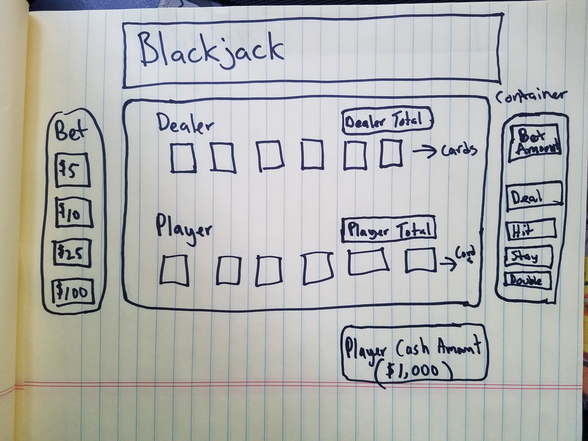

# Blackjack

Pseudocode

//constants
 Player
 Dealer
# Card
# Deck

# //variables
# Player chooses
# Dealer(computer) chooses
# Winner
#Shuffle

#//cached elements
#Cache divs for card, deck

#//event listeners
#Player choice click
#Play game again click

#//functions
#Initialize game
#Define player choices 
#Define dealer choice (computer/AI)
#Any event listeners
#Defining winner/loser
#displaying winning message
#Displaying losing message
#-Deal two random cards to player and dealer
#-Remove the dealt cards from the deck as they are dealt
-Player 'Hits' or 'Stays' or has BJ
-if player has BJ play moves to Dealer
-if player hits then another card is dealt
#-if total exceeds 21 player busts comp wins, else if player has > 16 && < 20 player can #-'Hit' or 'Stay', else 'Hit' 
#-Remove dealt cards from deck array
#continue until 'Stay' or 'Bust'
#Dealer plays if Player 'Stayed' or has BJ
#if dealer cards == BJ && players cards == BJ its a draw
#else if dealers cards < 16 dealer 'Hits'
#else if dealers cards > 16 && < 19 random ('Hit' or 'Stay')
#else if dealers cards >= 19 && <= 21 'Stay'
#else bust 
#Result compares 
#play again?
